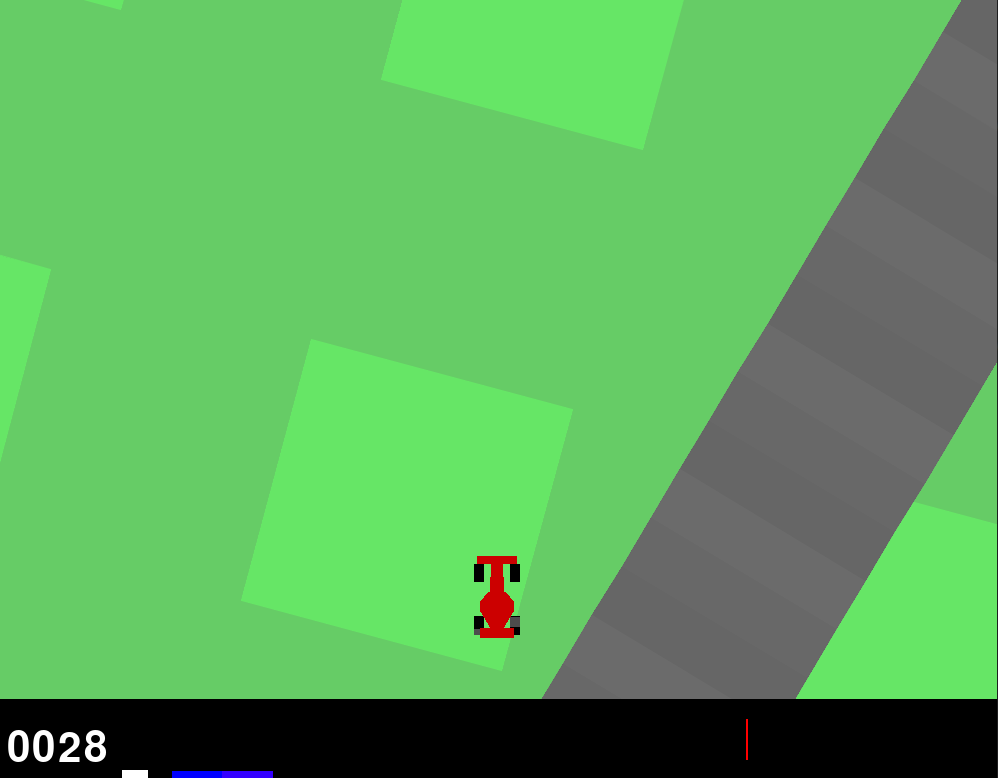
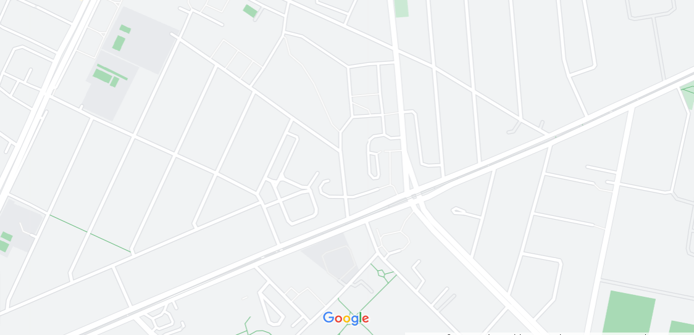
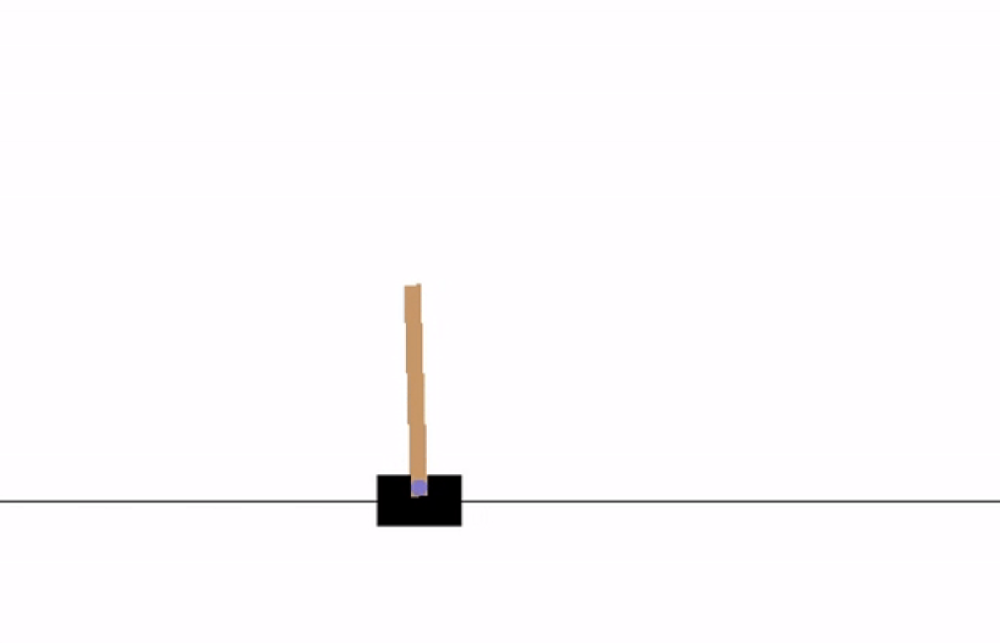
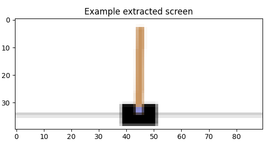
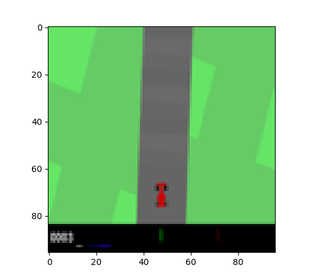
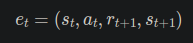
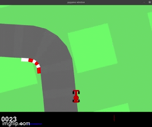
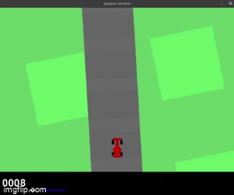

# Car control with reinforcement learning 

## Materials

#### Some relevant materials on reinforcement learning

- [PyTorch](https://pytorch.org/)
- [PyTorch examples tutorial](https://pytorch.org/tutorials/beginner/pytorch_with_examples.html)
- [Stable baselines3 - like sklearn but for RL, lot of abstraction, backend in PyTorch](https://github.com/DLR-RM/stable-baselines3)
- [Open AI Gym - Toolkit for reinforcement learning](https://gym.openai.com/)
- [SB3 Zoo - Alternative to Open AI Gym speciffically for SB3](https://github.com/DLR-RM/rl-baselines3-zoo)
- [Intro to RL and Stable Baselines + AI Gym](https://www.youtube.com/watch?v=XbWhJdQgi7E&list=PLQVvvaa0QuDf0O2DWwLZBfJeYY-JOeZB1)
- [RL Bootcamp - YT playlist](https://www.youtube.com/playlist?list=PLAdk-EyP1ND8MqJEJnSvaoUShrAWYe51U)
- [PPO algorithm and nicely prepped env](https://github.com/elsheikh21/car-racing-ppo)
- [Hierarchical RL for CarRacing](https://notanymike.github.io/HRL/)
- [Tensorflow alternative with Keras](https://keras.io/examples/rl/deep_q_network_breakout/)
- [Technical note on Q - learning](https://link.springer.com/content/pdf/10.1007/BF00992698.pdf)

#### Materials from supervisor

- [Reinforcement learning DQN algorithm tutorial](https://pytorch.org/tutorials/intermediate/reinforcement_q_learning.html)
- [Example of DQN car racing in Gym env](https://github.com/andywu0913/OpenAI-GYM-CarRacing-DQN/blob/master/resources/trial_600.gif)
- [Example of DQN and multicar racing in Gym env](https://github.com/igilitschenski/multi_car_racing)

Initial step when solving the problem will be to get hands on experience with
the toolkit and some basics of RL. So probably we will start from playing with 
examples.

## Installation steps and potential cavetas

When installed with pipenv (regular Python venvs manager), there were some [errors](https://stackoverflow.com/questions/44198228)
with LunarLander and CarRacing examples. Additional necessary packages were 
missing and the easiest and most coherent way to install them was to use 
Anaconda package manager for data science. Check out [conda installation guide](https://docs.conda.io/projects/conda/en/latest/user-guide/install/linux.html)
and [getting started with conda guide](https://docs.conda.io/projects/conda/en/latest/user-guide/getting-started.html)
to install and get some basic understanding of conda package manager.

conda and pip, in general, [should not be used together](https://www.anaconda.com/blog/using-pip-in-a-conda-environment)
as they might create hard to reproduce state and may break some things. This is
due a fact that conda cannot manage a packages installed via other package 
managers. 

**But, on some occassions, some packages may not be available from 
conda or may not be in right version, in that case one can use conda and pip 
together but some precauctions should be kept. The most important one is to 
install packages with conda first and then install rest with pip.** 

We will use this approach to have *gym version 0.24* in which few errors with 
CarRacing environment were resolved. Another thing to note here, is that we can
not use Stable Baselines3 as it will downgrade gym to version 0.21 which has 
some errors with CarRacing environment still not resolved.

#### Summary of packages installed

* Pytorch with cudatoolkit 11.3 (version for ubuntu 20.04 check if You have the same OS and GPU support) 
* Open AI gym version 0.23
* Swig
* Pygame
* gym-box2d
* \+ all the auto installed dependencies

If You want details about what is installed and in what version, check out 
the [environment.yml file](./environment.yml) containing conda envrionment 
informations and used for installation purposes.

In case of any doubts or errors visit appropriate docs site:
* [Pytorch installation docs](https://pytorch.org/get-started/locally/) 
* [Open AI Gym docs](https://gym.openai.com/docs/)
* [Conda managing environments docs](https://docs.conda.io/projects/conda/en/latest/user-guide/tasks/manage-environments.html#creating-an-environment-with-commands)


### Environment setup

conda offers very convinient envrionment setup using .yml file as a configuration
file. In such file all the dependencies are included and order of installation 
between conda / pip is also preserved. Such file was prepared and included in 
the repository. To install the envrionment clone the repository and from the 
repository directory create a conda enviroment:
```
$ git clone https://github.com/JakubSzukala/car-control-reinforcement-learning.git
$ cd car-control-reinforcement-learning/
$ conda env create -n car-control-rl-env -f environment.yml
```

If on the other hand, one would like to export the environment state to such 
configuration file simply run:
```
$ conda env export > environment.yml
```
Mind that this will overwrite the existing file.

Wait for conda to install all the packages. New conda environment will be 
called **car-control-rl-env** and You can check if it is available with:
```
$ conda env list
```
It should output something similar to this:
```
# conda environments:
#
base                  *  /home/js/Programms/anaconda3
car-control-rl-env       /home/js/Programms/anaconda3/envs/car-control-rl-env

```
Then activate it with:
```
$ conda activate car-control-rl-env
```
Succesfully activated environment is indicated by a prefix in the command line
with the name of the environment in brackets.

**Remember to activate the environment every time You work on the project.**

As a sanity check, You can run from within activated car-control-rl-env:
```
$ conda list | grep -E 'gym|swig|pygame|pytorch|box2d'
```
This should list most critical packages and their versions.

Deciding test if the environment is correctly configured is to run a demo of 
CarRacing. To do so, clone **to separate** directory gym repository and run 
CarRacing demo in which You can control the car:
```
$ git clone https://github.com/openai/gym.git
$ cd gym
$ python gym/envs/box2d/car_racing.py
```
If it runs without errors then the environment should be correctly configured:

**Remember to always have the car-control-rl-env activated.** Think of it as 
a ros's 'source devel/setup.bash'. Without it, the environment will not work.

### Relevant examples and experimenting scenarios
- [LunarLander-v2](https://gym.openai.com/envs/LunarLander-v2/) - one of examples provided in **Materials** section uses that scenario to explain basic RL concepts and training strategies
- [CarRacing-v0](https://gym.openai.com/envs/CarRacing-v0/) - the closest enviroment to the task of the project
- [Enduro-v0](https://gym.openai.com/envs/Enduro-v0/) - Atari race game, inputs available as images or RAM state of Atari (128B)
- [Riverraid-v0](https://gym.openai.com/envs/Riverraid-v0/) - Atari boat swimming game, inputs as images or RAM state

### Initial ideas to make the project more intresting and similar to autonomous car
- We were thinking about creating a proceduraly generated map of simple road 
net, with crossroads traffic lights maybe some car traffic
- Procedural generation of road system may be a separate project itself so maybe
it is a little overkill, but inspiration for that was *relative* simplicity of
a car racing env
- But maybe taking a 'satelite' photos of some cities and simplifying them to 
feed them into an algorithm could be feasible. Simplification probably could be
quite straight forward with OpenCV. For example: 



## Algorithm development

In this chapter we will describe the development of the application. We will use
mentioned sources but mostly we will use a [official PyTorch tutorial on RL](https://pytorch.org/tutorials/intermediate/reinforcement_q_learning.html).

#### Input extraction

This chapter follows the chapter from [official PyTorch tutorial on RL](https://pytorch.org/tutorials/intermediate/reinforcement_q_learning.html)
called exactly the same. We will try to extract the car from the image in 
similar way the authors of original Pytorch tutorial did. For comparrission 
original image of the cart pole and extracted image:




From analysing the code we can see that we basically extract ROI, removing
unnecessary parts of the image and centering the cart in extracted image. After
that we convert to float, normalize, rescale and convert to tensor.

In [one of the examples](https://github.com/andywu0913/OpenAI-GYM-CarRacing-DQN/blob/master/common_functions.py)
speciffically for the CarRacing the image extraction is even simpler and uses 
cv2 for processing:
```python
def process_state_image(state):
    state = cv2.cvtColor(state, cv2.COLOR_BGR2GRAY)
    state = state.astype(float)
    state /= 255.0
    return state
```
Probably some middle ground will be the best choice, as simplification of the 
input in official pytorch tutorial seems very appealing. 

Initial results of the input image from the eye test look pretty good:


Some initial remarks:
* The return function is blurry and unreadable so maybe mask it somehow? To not distract / create some random correlation. **Probably not necessary, can be extracted from env.**
* Other drive statistics are barely visible, will have to see when the car actually drives but maybe they can stay?
* Rest of the image seems to have satisfying quality
* Make it to Gray scale?

#### Replay memory
In [pytorch tutorial](https://pytorch.org/tutorials/intermediate/reinforcement_q_learning.html)
they use a **replay memory** for DQN training. Replay memory is a approach, in which
we store the **transitions** of the environment state. It can be described as a
tuple in following form:


* *st* - state at time *t*
* *at* - action at time *t*
* *rt+1* - reward at time *t+1* given to the agent as result of previous state / action pair
* *st+1* - next state of the environment at *t+1*

So a lot of such tuples compose a replay memory. From it, we randomly sample 
to train our network. Such act is called **experience replay**.

**Most important result of using this technique, is decorrelation of the data.**
 

#### Q-network

According to [pytorch tutorial](https://pytorch.org/tutorials/intermediate/reinforcement_q_learning.html)
our network will take as an input a difference between current and previous 
patches, taken from **replay memory**.

Initially, our network will consist of 3 convolutional layers with batch 
normalization in between. This is up for change. Parameters were taken from 
[pytorch tutorial](https://pytorch.org/tutorials/intermediate/reinforcement_q_learning.html).


#### Training procedure
Here we again follow the receipe from [pytorch tutorial](https://pytorch.org/tutorials/intermediate/reinforcement_q_learning.html).

In the tutorial, they present a function *select_action* that will pick an action 
to take. And there are two possibilities here:
* Random action will be chosen from uniform distribution
* Model will be used to pick the action

At the beginning we will pick the actions randomly, so that our model will have 
a chance to learn and modify its weights / biases. Later we will use the model more often
to choose an action and will check its performance. The rate at which this process
will change is defined with use of parameters EPS_START, EPS_END and EPS_DECAY.
This parameters defines a probability of choosing a random action and will decay 
over time until EPS_END with rate of EPS_DECAY. **This is up for tuning too.**
This basically defines a rate of change between exploration and exploitation.

For the starter, we will create an environment as a discrete:

```python
env = gym.make('CarRacing-v1', continous=False)
```

This will change continous action space into:

```python
[do nothing, left, right, gas, brake]
```

Actually there was weird error in the environment, as we primarily had version
0.23 of gym and it allowed creating the CarRacing-v1 environment despite it not being 
available in this version! This caused a lot of confusion and came up when passing argument
continous=False, it was throwing error that the argument is not correct. Upgrading
gym to 0.24 which already has a CarRacing-v1 solved the issue.

#### First training 

We implemented initial infrastructure for training the model. When running for 
the first time, the gray scale input was breaking during the convolution due
to some incorrect dimensions when using model structure like in [pytorch tutorial](https://pytorch.org/tutorials/intermediate/reinforcement_q_learning.html).
This is for solving with [this as an example](https://github.com/andywu0913/OpenAI-GYM-CarRacing-DQN/blob/master/CarRacingDQNAgent.py).
In this example, author is using gray scale input so we can analyse theirs NN 
structure. Theirs network was implemented in tensorflow so copying 1:1 is not 
the case:
```python
model = Sequential()
model.add(Conv2D(filters=6, kernel_size=(7, 7), strides=3, activation='relu', input_shape=(96, 96, self.frame_stack_num)))
model.add(MaxPooling2D(pool_size=(2, 2)))
model.add(Conv2D(filters=12, kernel_size=(4, 4), activation='relu'))
model.add(MaxPooling2D(pool_size=(2, 2)))
model.add(Flatten())
model.add(Dense(216, activation='relu'))
model.add(Dense(len(self.action_space), activation=None))
model.compile(loss='mean_squared_error', optimizer=Adam(lr=self.learning_rate, epsilon=1e-7))
```

So first training was for episodes n = 60 and as mentioned before with an input
as RGB. The results were less than amazing and learning lasted for quite a long time,
about ~70 mins. Highest reward that the model achieved was ~ -21 which means that
it did not finish even one track tile (reward for visiting track tile is + 1000 / N).
The car was at least not moving out of bounds because during the training it was not
usually receiving reward of -100. 

The first trained model is saved now and we will prepare a runner that will 
showcase how it performs and what can be improved upon.

#### Test runner results 

Below on the gif is presented initialy tested model on RGB images 60 iters and
network structure as in [pytorch example](https://pytorch.org/tutorials/intermediate/reinforcement_q_learning.html):
```python
self.conv1 = nn.Conv2d(
        in_channels=3,   
        out_channels=16, 
        kernel_size=5,   
        stride=2)        
self.bn1 = nn.BatchNorm2d(16)
self.conv2 = nn.Conv2d(16, 32, kernel_size=5, stride=2)
self.bn2 = nn.BatchNorm2d(32)
self.conv3 = nn.Conv2d(32, 32, kernel_size=5, stride=2)
self.bn3 = nn.BatchNorm2d(32)
```



It acts quite randomly not really reacting much. In the end it actually tries to
turn left but it is very delayed.

#### Improving initial run
In [this example](https://github.com/andywu0913/OpenAI-GYM-CarRacing-DQN/blob/master/CarRacingDQNAgent.py)
the author took very intresting approach of stacking three consecutive gray
scale frames together as an input to the network which could be an intresting 
deviation from the approach that we initally adopted, that is calculating 
the difference / transition between frames.

After testing the same setup like in initial run, but with changed image to gray 
scale and increasing the number of iterations to 90, we did not get better results,
actually they got worse. The reward earned was improving at promising rate but 
then suddenly plumited. Hopefully it is not a sign of [catastrophic forgetting](https://stackoverflow.com/questions/54237327),
as it should be handled in our model.

**Also, we should be mindfull with the size of the model, as when training the 
second iteration on my computer, suddenly the process was killed by a kernel due
to using too much memory (including swap!).** The reason was clearly visible when 
running:

```
$ sudo dmesg
    [ 7366.987512] oom-kill:constraint=CONSTRAINT_NONE,nodemask=(null),cpuset=/,mems_allowed=0,global_oom,task_memcg=/user.slice/user-1000.slice/user@1000.service,task=python3,pid=18000,uid=1000
[ 7366.987621] Out of memory: Killed process 18000 (python3) total-vm:27177916kB, anon-rss:14510316kB, file-rss:96488kB, shmem-rss:12288kB, UID:1000 pgtables:32784kB oom_score_adj:0
```

Intrestingly, using single channel gray caused this problem and when using RGB 
there was no such thing. Turning off the browser was enough for the model to learn,
but I had barely enough memory for it.

Results basically were the same for every test we did. The model was steering 
very hard to the right:


TODOs:
- [ ] Change the approach of feeding the input to stacking 3 grayscale images (in new branch)
- [ ] Add saving a model to new file instead of overwriting (essential)
- [ ] Add plotting a reward across learning (essential)
- [ ] For test runner add model to execute as command line argument
- [ ] Decouple a little bit more the functions as they are quite hard coded (optional)


